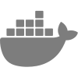
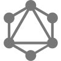
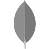

# Hi, I'm Tom

<h3 align="center">Computer Science & Cybersecurity Engineering Student</h3>

  

  

---

## About Me

- 🎓 Computer Science & Cybersecurity Engineering Student
- 📍 Based in Lyon, France
- 🔍 **Currently looking for an apprenticeship** (1 week / 1 week rhythm)
- 🌱 Specializing in Cybersecurity, DevOps, DevSecOps and AI Agents
- 💻 Interested in development, cloud, DevOps culture, security and AI automation
- 🌐 Check out my work on my portfolio: **[portfolio-tom-poncet.com](https://www.portfolio-tom-poncet.com/)**
- ⚡ Always learning and building something new

---

## Tech Stack

  
  
  
  
  
  
  
  
  
  
  
  
  
  
  
  
  
  
  
  
  
  
  
  
  
  
  
  
  
  
  
  
  
  
  
  
  
  
  
  
  
  
  
  
  
  
  
  
  

---

## GitHub Streak

  

---

## Contribution Graph

  

---

## Get In Touch

  

---

## 💡 Quote

> "Learning never stops. Every day is an opportunity to improve."

---

  Thanks for visiting my profile! 🚀

